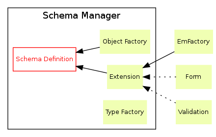

Core architecture
=================

The core of PUM is the big magic box providing a lot of love:

* Dynamic definition of a schema

  * Define advanced field types (wip)
  * Relations between objects

* Extensions

  * Doctrine entities & entity managers
  * Symfony Forms

Schema and objects
::::::::::::::::::

PUM is composed of two very different worlds:

* The **schema world**, where you have an *ObjectDefinition* and add *FieldDefinition*s on it,
  provide options for those types. You are **specifying a schema**
* The **usage world** is the application creating **instances** of your schema, when you
  benefit from the schema you defined above

Architecture details
::::::::::::::::::::

Schema Definition
-----------------

This is the model of your application : projects, beams, objects and fields.
Here, you are saying "*hey, I wanna add a column ``is_highlight`` to my blog post entities:

.. code-block:: php

    $pum = new SchemaManager(...);
    $beam = $pum->getBeam('blog');

    $beam
        ->getObject('blog_post')
        ->createField('is_highlight', 'boolean')
    ;

    $pum->saveBeam($beam);

That's it! A simple PHP interface to manipulate the schema definition. This API is
mainly used by Woodwork, an editor for SchemaDefinition.

TypeFactory
-----------

The TypeFactory contains all type objects, instances providing data types in PUM:
text, integer, boolean, choice list, price, geolocation...

Object Factory
--------------

The object factory is responsible of generating classes from the schema definition.

To do so, it generates **metadatas**, acting as "production-cache" for dynamic entities.
This cache is only generated once in production and cleaned as soon as the schema
is modified (located in ``app/cache/<end>/pum_objects``).

Extension
---------

Some behaviors have been moved out to extension, to have a modular architecture.

Those extensions listen to schema manager events:

* Beam created/updated/deleted
* Project created/updated/deleted

As soon as one of those events occurs, they do their business (EmFactory will update
DB schema according to modifications).

The production needings
:::::::::::::::::::::::

When you're in production, **SchemaDefinition** should never be accessed. This part
is costful and memory-consuming: manipulation of it implies many objects hydrations.

To work properly, **SchemaDefinition** usually fetches all beams and all projects
available.

For this reason, we only address project and objects through their names (represented
as strings). Extensions should rely on cache to avoid hitting the schema definition.
