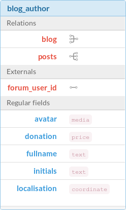

The schema
==========

The very-fundamental part of PŪM is it's **schema definition**. The schema definition contains metadata about objects you create. This schema definition is composed of many parts:

Object, Fields and Relations
----------------------------

It's possible for you to create a new schema through the back-office. For example, you can define a blog object like this:

    :alt: An example object "blog_author" with field definitions

Declaring objects
.................

Within PŪM, this definition is represented as an *ObjectDefinition*:

.. code-block:: php

    $objectDef = new Pum\Core\Definition\ObjectDefinition('blog_author');

    $objectDef
        ->setClassName('MyCustomClass')
        ->createField('fullname', 'text')
        ->createField('avatar', 'media')
        ->createField('donation', 'price')
    ;

Create relations
................

**WARNING**: this part of API should change, to use a proper Relation object.

You can also create relations on the definition, like this:

.. code-block:: php

    // TODO: change the API (ObjectDefinition::createRelation() : Relation)

    $objectDef->createField('blog', 'relation', array(
        'target'      => 'blog'
    ))

Crawling an object
..................

To read the definition of an object, you can use it's API:

.. code-block:: php

    $objectDef->getClassName(); // returns a string (the classname) or null (no custom class defined)

    $objectDef->getField('fullname'); // returns a FieldDefinition object

Field options
.............

Each object's field can have properties, related to his type:

.. code-block:: php

    $objectDef->getField('fullname')->setOption('required', true);

Those options are used to attach metadatas to fields and allow to change behavior of the column.

For example, the **text** column can have those options:

* **required** (boolean)
* **multilines** (boolean)
* **min_length** (integer)
* **max_length** (integer)

Those options should be agnostic from extensions (Doctrine, ElasticSearch, ...). Each of those extensions must define its rules from generic options.

Beams
-----

Object definitions must be attached to a *Beam*. This *Beam* represents a collection of definitions:

.. code-block:: php

    $beam = new Pum\Core\Definition\Beam('blog');

    // adds the ObjectDefinition created previously
    $beam->addObject($objectDef);

Within a *Beam*, you can add many object definitions, so that you can transport a complete model at once (by transporting the *Beam*). Those beams represent features in PŪM:

* A blog
* A forum
* A CMS
* ...

Projects
--------

When you have a collection of *Beams*, you can group them together to create a *Project*.

Whereas the *Beam* represents a feature, it is not available to the user until you create a *Project* for it:

.. code-block: php

    $project = new Pum\Core\Definition\Project('my-company');
    $project->addBeam($beam);

The interest of this solution is that you can have multiple projects in the same instance of PŪM:

.. code-block:: php

    $teamA = new Pum\Core\Definition\Project('team-A');
    $teamB = new Pum\Core\Definition\Project('team-B');

    $teamA->addBeam($blog);
    $teamA->addBeam($cms);

    $teamB->addBeam($cms);
